```{r,include=FALSE,purl=FALSE}
suppressPackageStartupMessages(require(knitr))
knitr::opts_chunk$set(echo = TRUE, tidy = T)
```

```{=html}
<style>
.reveal pre code {
  max-height: none;
  /* font-size: 0.75em; */
}
</style>
```

::: {.content-hidden when-format="revealjs"}
# ???My Course name (session1)???
:::

## Overview

??We often put an overview slide that links to the various parts of the course content to make it easy to navigate — here it links to sections later in this same session??

- [Materials](#materials)
- [Course materials](#course-materials)
- [Links](#links)
- [Section A](#section-a)

# Set Up {background-color="#23373B" .center .middle}

## Materials

??We try to denote each major section of content with these title slides (see above for set up). A level-1 heading (`#`) becomes an inverse section-divider slide; a level-2 heading (`##`) is a normal slide. The hierarchy also drives the single-page version.??

?? Materials just gives the links to download the package. Just ensure links are up to date??

All prerequisites, links to material and slides for this course can be found on github.

* [Intro_To_R_1](https://rockefelleruniversity.github.io/Intro_To_R_1Day/)

Or can be downloaded as a zip archive from here.

* [Download zip](https://github.com/rockefelleruniversity/Intro_To_R_1Day/zipball/master)

## Course materials

?? this slide just shows where thye can get the course content from the download. You do not need to populate these directories. It will be made during compilation??

Once the zip file in unarchived. All presentations as HTML slides and pages, their R code and HTML practical sheets will be available in the directories underneath.

* **docs/presentations/slides/**
Presentations as an HTML slide show.
* **docs/presentations/singlepage/**
Presentations as an HTML single page.
* **docs/presentations/r_code/**
R code in presentations.
* **docs/exercises/**
Practicals as HTML pages.
* **docs/answers/**
Practicals with answers as HTML pages and R code solutions.

## Set the Working directory

Before running any of the code in the practicals or slides we need to set the working directory to the folder we unarchived.

You may navigate to the unarchived RU_Course_help folder in the Rstudio menu.

**Session -> Set Working Directory -> Choose Directory**

or in the console.

```{r setwd_introtoR,eval=F}
setwd("/PathToMyDownload/RU_Course_template/docs")
# e.g. setwd("~/Downloads/Intro_To_R_1Day/r_course")
```


# Introduction to single cell ATAC sequencing {background-color="#23373B" .center .middle}

## Overview

- High-throughput Sequencing
- Emergence of single-cell
- Differing single-cell assays
- Differing single-cell technologies
- Overview of Single-cell sequencing


## Sequencing

The emergence of high-throughput sequencing technologies such as 454 (Roche) and Solexa (Illumina) sequencing allowed for the highly parallel short read sequencing of DNA molecules.

- 454 (Roche) ~ 2005
- Solexa (Illumina)  ~ 2006


## Sequencing overview

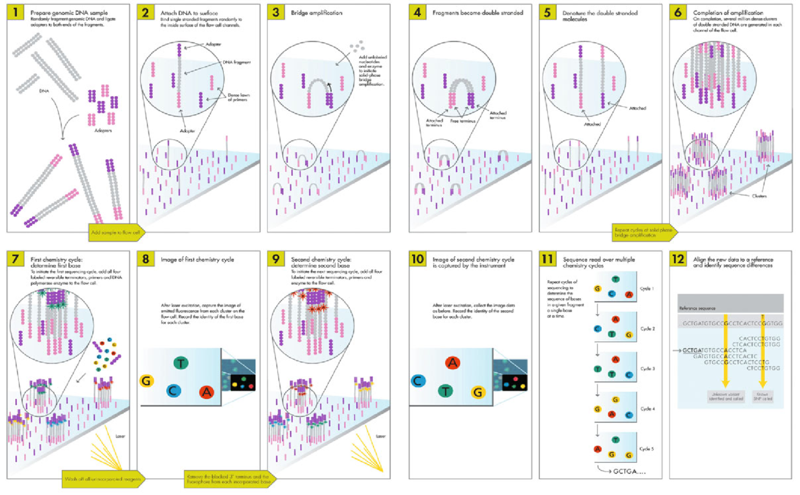


## Sequence files - FastQ
 **FastQ (FASTA with Qualities)**
 
<div align="center">
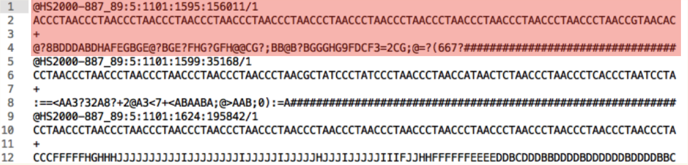
</div>

- "@" followed by identifier.
- Sequence information.
- "+" 
- Quality scores encodes as ASCI.


## Sequence files - FastQ
 **FastQ - Header**
 
<div align="center">
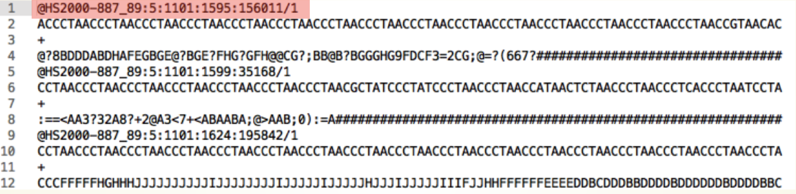
</div>

- Header for each read can contain additional information
    - HS2000-887_89 - Machine name.
    - 5 - Flowcell lane.
    - /1 - Read 1 or 2 of pair (here read 1)
    


## Sequence files - FastQ

**FastQ - Qualities**

<div align="center">
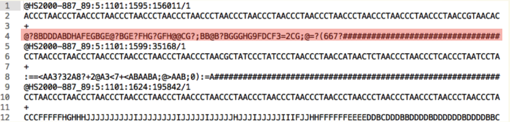
</div>
 
- Qualities follow "+" line.
- -log10 probability of sequence base being wrong. 
- Encoded in ASCI to save space.
- Used in quality assessment and downstream analysis
 


## Sequencing use cases

- ChIP-seq - Study transcription factor binding
- RNA-seq - Study genome wide transcriptomics
- Whole Genome/Exome Sequencing - Study genome variation/changes
- MNAseq/DNAse-seq/ATAC-seq - Study chromatin structure/accessibility
- CrispR-seq - Study genome wide phenotypes
- And many more..


## Bulk sequencing methods

Sequencing typically performed on bulk tissue or cells.

- Tissues - Liver vs Heart
- Conditions - Cancer vs surrounding normal tissue
- Treatments - Hep-G2 cells with/without rapamycin 
- Genetic perturbation - Ikzf WT/KO in B-cells.

Analysis of the bulk characteristics of data without understanding of hetergeneity of data.


## FACS Cell and Nuclei sorting

Newer technologies such as TRAP from the Heintz lab or nuclei sorting allow for capture of distinct cell types based on expressed markers.

Pros
- Allow for the capture of rare cell populations such as specific neuron types.

Cons
- Require known markers for desired cell populations.


## Single-cell sequencing

With the advent of advanced microfluidics and refined sequencing technologies, single-cell sequencing has emerged as a technology to profile individual cells from a heterogeneous population without prior knowledge of cell populations.

Pros
- No prior knowledge of cell populations required.
- Simultaneously assess profiles of 1000s of cells.

Cons
- Low sequencing sequencing depth for individual cells (1000s vs millions of reads for bulk). 


## Single-cell use cases

Single-cell sequencing, as with bulk sequencing, has now been applied to the study of a wide range of differing assays.

- scRNA-seq/snRNA-seq - Transcriptomics
- **scATAC-seq/snATAC-seq - Chromatin accessibility**
- CITE-seq - Surface protein expression
- AIRR - TCR/BCR profiling
- Spatial-seq - Spatial profiling of gene expression.


# ATAC sequencing {background-color="#23373B" .center .middle}

## ATACseq

ATACseq (Assay for Transposase-Accessible Chromatin using sequencing) uses a transposase to efficiently fragment accessible DNA prior to sequencing. The result provides a method to map the accessible/open chromatin genome wide.

In contrast to other techniques, ATACseq has several advantages including

* Low input material required (> 10,000 cells)
* Rapid experiment protocol (~ 4 hrs.)


<div align="center">
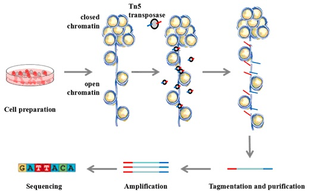
</div>


## ATACseq, MNaseseq and DNaseseq

<div align="center">
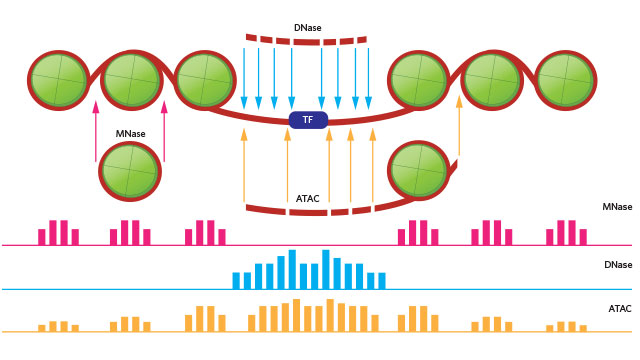
</div>

* DNaseseq - Enzymatic digestion to extract signal from open chromatin around transcription factor binding sites.

* MNaseseq - Enzymatic digestion to extract signal repesenting nucleosome positioning.

* ATACseq - Uses transposases and offers a method to simultaneously extract signal from transcription factors binding sites and nucleosome positions from a single sample.


## Working with ATACseq data

In this session we will look at some of the basics of ATACseq processing in R using some publically available data.

We will look at the alignment, post-alignment processing and plotting of ATACseq data over TSSs.

# 10x platform {background-color="#23373B" .center .middle}

## Single-cell platforms

- **10x Genomics - droplet/microfluidics)**
- sci-ATAC-seq/Parse - Combinatorial Indexing 
- BD Rhapsody - plate based

10x is the most popular and is known to produce high quality data. Combinatorial methods scale better, don't require specialized equipment, and are more cost effective. 


## The 10x Genomics system  - Gel beads

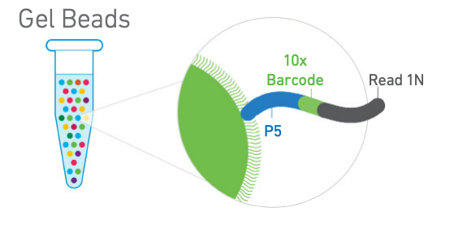{.nostretch width=50% fig-align="center"}

::: {style="font-size: 30%;"}
source: [ 10x scATAC User Guide](https://cdn.10xgenomics.com/image/upload/v1728078402/support-documents/CG000496_Chromium_NextGEM_SingleCell_ATAC_ReagentKits_v2_UserGuide_RevC.pdf.pdf){target="_blank"}
:::

## The 10x Genomics system - Microfluidics

::: {.columns}

::: {.column width="40%"}
::: {style="font-size: 70%;"}
- DNA within nuclei are fragmented in bulk with transposase
- Nuclei are combined with beads
- Beads + nuclei are partitioned into Gel Beads-in-emulsion (GEMs) by oil
:::
:::

::: {.column width="60%"}
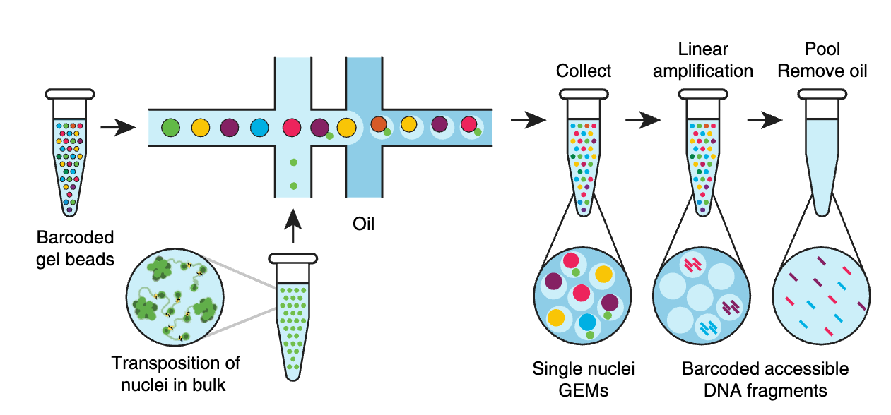
:::

:::

::: {style="font-size: 30%;"}
[Satpathy et al., Nat. Biotechnology, 2019](https://pubmed.ncbi.nlm.nih.gov/31375813/){target="_blank"}
:::

## The 10x Genomics system  - Amplification within GEM

Inside the GEM, the P5 primer and the cell barcode are added to each read

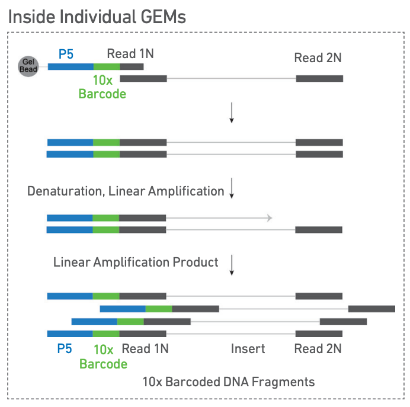

::: {style="font-size: 30%;"}
source: [ 10x scATAC User Guide](https://cdn.10xgenomics.com/image/upload/v1728078402/support-documents/CG000496_Chromium_NextGEM_SingleCell_ATAC_ReagentKits_v2_UserGuide_RevC.pdf.pdf){target="_blank"}
:::


## The 10x Genomics system  - Sample/Pool amplification in bulk

The GEMs are then chemically broken, and the P7 primer and sample index are added in bulk. 

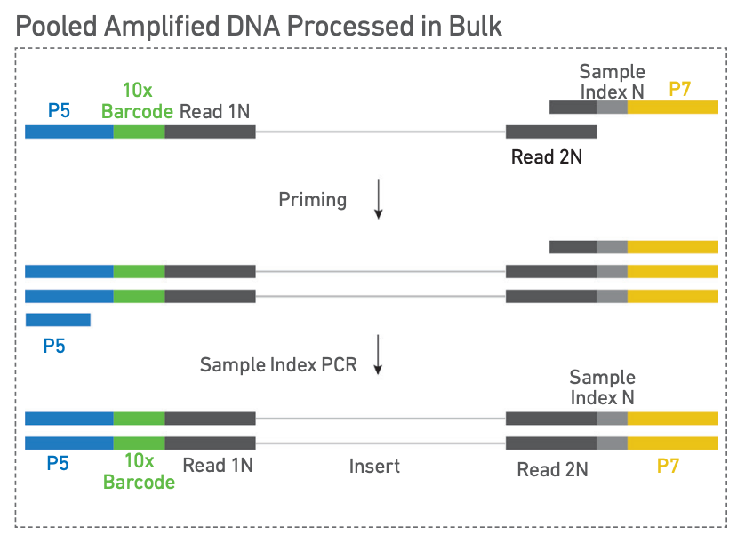

::: {style="font-size: 30%;"}
source: [ 10x scATAC User Guide](https://cdn.10xgenomics.com/image/upload/v1728078402/support-documents/CG000496_Chromium_NextGEM_SingleCell_ATAC_ReagentKits_v2_UserGuide_RevC.pdf.pdf){target="_blank"}
:::

## The 10x sequence reads

Today we will be looking at data from 500 Peripheral Blood Mononuclear Cells (PBMC) downloaded from the 10x website ([link to dataset](https://www.10xgenomics.com/datasets/500-peripheral-blood-mononuclear-cells-pbm-cs-from-a-healthy-donor-next-gem-v-1-1-1-1-standard-2-0-0){target="_blank"}).

```{shell}
wget https://cf.10xgenomics.com/samples/cell-atac/2.0.0/atac_pbmc_500_nextgem/atac_pbmc_500_nextgem_fastqs.tar
```

<br>
<br>

Unpack this folder

```{shell, eval=FALSE}
tar -xvf atac_pbmc_500_nextgem_fastqs.tar 
```


## The 10x sequence reads

::: {style="font-size: 70%;"}


- Information on sample identity (Index read - I1)
  + this is used for demutliplexing, usually handled by [Illumina's BCL Convert software](https://www.10xgenomics.com/support/software/cell-ranger-atac/latest/analysis/inputs/direct-demultiplexing-with-illumina-software){target="_blank"}
:::

```{=html}
<pre class="tree">
atac_pbmc_500_nextgem_fastqs/
├── <mark>atac_pbmc_500_nextgem_S1_L001_I1_001.fastq.gz ← sample index </mark>
├── atac_pbmc_500_nextgem_S1_L001_R1_001.fastq.gz ← fragment read 1
├── atac_pbmc_500_nextgem_S1_L001_R2_001.fastq.gz ← cell barcode
└── atac_pbmc_500_nextgem_S1_L001_R3_001.fastq.gz ← fragment read 2
</pre>
```


## The 10x sequence reads

::: {style="font-size: 70%;"}


- [Information on sample identity (Index read - I1)]{style="color: grey;"}
  + [this is used for demutliplexing, usually handled by [Illumina's BCL Convert software](https://www.10xgenomics.com/support/software/cell-ranger-atac/latest/analysis/inputs/direct-demultiplexing-with-illumina-software){target="_blank"}]{style="color: grey;"}
- Information on the DNA fragment (accessible region read - paired R1 and R3)
:::

```{=html}
<pre class="tree">
atac_pbmc_500_nextgem_fastqs/
├── atac_pbmc_500_nextgem_S1_L001_I1_001.fastq.gz ← sample index 
├── <mark>atac_pbmc_500_nextgem_S1_L001_R1_001.fastq.gz ← fragment read 1</mark>
├── atac_pbmc_500_nextgem_S1_L001_R2_001.fastq.gz ← cell barcode
└── <mark>atac_pbmc_500_nextgem_S1_L001_R3_001.fastq.gz ← fragment read 2</mark>
</pre>
```

## The 10x sequence reads

::: {style="font-size: 70%;"}


- [Information on sample identity (Index read - I1)]{style="color: grey;"}
  + [this is used for demutliplexing, usually handled by [Illumina's BCL Convert software](https://www.10xgenomics.com/support/software/cell-ranger-atac/latest/analysis/inputs/direct-demultiplexing-with-illumina-software){target="_blank"}]{style="color: grey;"}
- [Information on the DNA fragment (accessible region read - paired R1 and R3)]{style="color: grey;"}
- Information on cell identity (10x barcode - R2)
:::

```{=html}
<pre class="tree">
atac_pbmc_500_nextgem_fastqs/
├── atac_pbmc_500_nextgem_S1_L001_I1_001.fastq.gz ← sample index 
├── atac_pbmc_500_nextgem_S1_L001_R1_001.fastq.gz ← fragment read 1
├── <mark>atac_pbmc_500_nextgem_S1_L001_R2_001.fastq.gz ← cell barcode</mark>
└── atac_pbmc_500_nextgem_S1_L001_R3_001.fastq.gz ← fragment read 2
</pre>
```

## The 10x sequence reads

::: {style="font-size: 70%;"}


- [Information on sample identity (Index read - I1)]{style="color: grey;"}
  + [this is used for demutliplexing, usually handled by [Illumina's BCL Convert software](https://www.10xgenomics.com/support/software/cell-ranger-atac/latest/analysis/inputs/direct-demultiplexing-with-illumina-software){target="_blank"}]{style="color: grey;"}
- [Information on the DNA fragment (accessible region read - paired R1 and R3)]{style="color: grey;"}
- [Information on cell identity (10x barcode - R2)]{style="color: grey;"}
:::

```{=html}
<pre class="tree">
atac_pbmc_500_nextgem_fastqs/
├── atac_pbmc_500_nextgem_S1_L001_I1_001.fastq.gz ← sample index 
├── atac_pbmc_500_nextgem_S1_L001_R1_001.fastq.gz ← fragment read 1
├── <mark>atac_pbmc_500_nextgem_S1_L001_R2_001.fastq.gz ← cell barcode</mark>
└── atac_pbmc_500_nextgem_S1_L001_R3_001.fastq.gz ← fragment read 2
</pre>
```

::: {style="font-size: 70%;"}
- NOTE: no UMI is needed because only two copies of a fragment in diploid cell.
:::


## From Sequences to Processed data

As with standard ATAC sequencing data, the next steps are typically to align the data to a reference genome, identify cells, call peaks, and summarize data to a peak matrix.

- Cell Ranger count atac (uses BWA) and calls peaks on all cells
- Cell Ranger is used to get fragments, and cluster or celltype-level peak sets are made in downstream analyses (e.g. Signac or SnapATAC)
- chromap is another scATAC-centric software to get fragments (cell and peak calling don manually)
- custom alignment can be performed outside of Cell Ranger 


# Cell Ranger {background-color="#23373B" .center .middle}

## Cell Ranger ATAC

Cell Ranger ATAC is the typical approach we use to process 10x data. The default setting are pretty good. This is an intensive program, so we will not be running this locally on your laptops. Instead we run it on remote systems , like the HPC.

If you are working with your own data, the data will often be provided as the Cell Ranger output by the Genomics/Bioinformatics teams, like here at Rockefeller University. 


## Cell Ranger ATAC

::: {.columns}

::: {.column width="50%"}

Cell Ranger is a suite of tools for single cell processing and analysis available from 10X Genomics. It performs key processing steps i.e. demultiplexing, conversion to FASTQ and mapping. It is also the first chance to delve into your data sets QC. 

In this session we will give a brief overview of running this tool and then dive deeper into interpreting the outputs.
:::

::: {.column width="50%"}
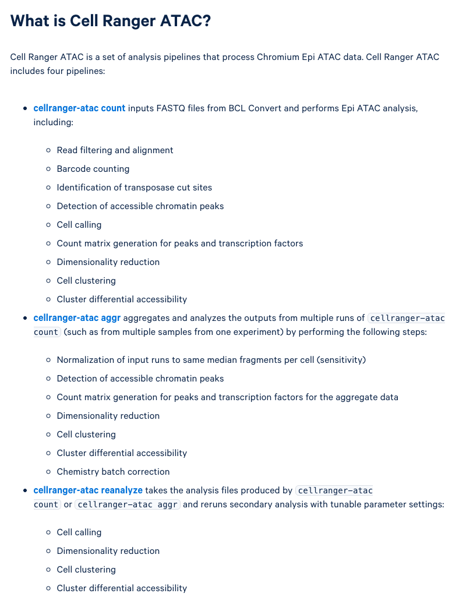
:::

:::

## Do I need to run this?

- Often genomics centers will run it for you and deliver mtx/hdf5 files (i.e. here at Rockefeller)

- Why run Cell Ranger yourself?:
  * You want to integrate data sets, but they were processed by different versions of Cell Ranger
  * You may want to change Cell Ranger parameters i.e. export BAMs, or force an expected cell number
  * Most commonly you want to reanalyze a published data set


## Cell Ranger ATAC Download

::: {.columns}

::: {.column width="50%"}
- Cell Ranger is available from the [10x genomics website](https://www.10xgenomics.com/support/software/cell-ranger-atac/downloads){target="_blank"}.

- Also available are pre-baked references for Human and Mouse genomes (GRCh38 and GRCm38/9)
:::

::: {.column width="50%"}

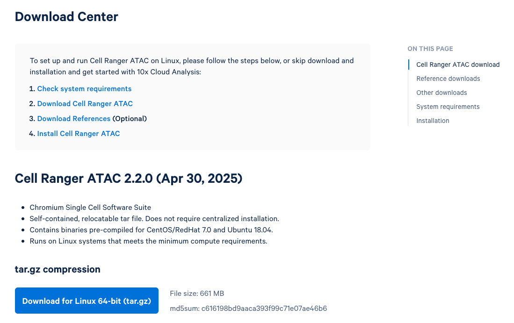

:::

:::

## Cell Ranger ATAC

- Cell Ranger only runs on linux machines (CentOS/RedHat 7.0+ and Ubuntu 14.04+).
- Due to memory requirements, typically users run Cell Ranger on a remote server and not their own machines
- To download Cell Ranger and the required reference onto a remote server, we typically use the *wget* command (these commands are all on the [Download](https://www.10xgenomics.com/support/software/cell-ranger-atac/downloads){target="_blank"} page)

[This will all be in terminal on the server you are using]

```{shell, eval=FALSE}
wget -O cellranger-atac-2.2.0.tar.gz "https://cf.10xgenomics.com/releases/cell-atac/cellranger-atac-2.2.0.tar.gz?Expires=1790236407&Key-Pair-Id=APKAI7S6A5RYOXBWRPDA&Signature=KD5CNhBTKkkdwbdJkXjVmf-ybpjwUJ8~MsVSCf2dL~cW7j8LGc0PMWz6arvTTzNq0u5ZBMzqI02L3KBS6-pImXFwegQ8VxN4RPGVCY-V1UvWD~NqYEFsdBcCM~EeJKbd9sGOlTklk7xQ9XdP0tHZnBLpixC3BjqH~ymDcZZSc6RqBWy3kCQ7uzGWi-PQPKEYLbPS4Pd-enmFbgPplDYjHPmmpa5S7nCegzlfYBnYOnYN8iahjsTkOxrYv~KWf4g9uKVU-Z~lW-gx7mt2RIHfVfTy9zLnmdb~AC-xtryUH6jyPvN7nxpaQw3FchRaXtIZVNm59UfPfIstIRrgcDqhBw__"
```


## Cell Ranger ATAC

Download reference genome for Cell Ranger i.e. Human genome (GRCh38)

DOUG: explain ARC genome
```{shell, eval=FALSE}
wget "https://cf.10xgenomics.com/supp/cell-arc/refdata-cellranger-arc-GRCh38-2024-A.tar.gz"
```


## Cell Ranger set-up

Having downloaded the software and references, we can then unpack them.

```{shell, eval=FALSE}
tar -xzvf cellranger-atac-2.2.0.tar.gz
tar -xzvf refdata-cellranger-arc-GRCm39-2024-A.tar.gz
```

<br>
<br>
Finally we can add the cellranger directory to our PATH.

```{shell, eval=FALSE}
export PATH=/PATH_TO_CELLRANGER_DIRECTORY/cellranger-atac-2.2.0:$PATH
```


## Running Cell Ranger ATAC count

Now we have the downloaded Cell Ranger software and the reference we can start the processing of our fastQ files.

Typically FastQ files for your scATAC run will have been demultiplexed, likely using [Illumina's BCL Convert software](https://www.10xgenomics.com/support/software/cell-ranger-atac/latest/analysis/inputs/direct-demultiplexing-with-illumina-software){target="_blank"} to produce a directory of FastQ files. 


## Running Cell Ranger ATAC count

With the Cell Ranger software and pre-built reference files, we can generate count data from the FASTQ files. This will make a count matrix and associated files.

- --id will be used to name output files
- the --sample argument is used to select samples from the fastq folder. 
  + fastq filenames with this string will be used and multiple names can be separated by commas

```{shell, eval=FALSE}
cellranger-atac count --id=pbmc_500 \
   --sample atac_pbmc_500_nextgem \
   --fastqs=PATH_TO_FASTQ_DIRECTORY \
   --reference=/PATH_TO_CELLRANGER_DIRECTORY/refdata-cellranger-arc-GRCh38-2024-A.tar.gz
```


## Working with custom genomes

If you are working with a genome which is not Human and/or mouse you will need to find another source for your Cell Ranger reference.

- Luckily many references are pre-built by other consortiums.
- We can build our own references using other tools in Cell Ranger using the *mkgtf* and *mkref* functions.
- For this you just need a FASTA file (DNA sequence) and a GTF file (Gene Annotation) for your reference.


## Creating your own reference

To create your own references you will need two additional files.

- FASTA file - File containing the full genome sequence for the reference of interest
- GTF file - File containing the gene/transcript models for the reference of interest.


## FASTA file (Genome sequence)

- The reference genome stored as a collection of contigs/chromosomes.
- A contig is a stretch of DNA sequence encoded as A,G,C,T,N.
- Typically comes in FASTA format.
    - ">" line contains information on contig
    - Lines following contain contig sequence

<div align="center">
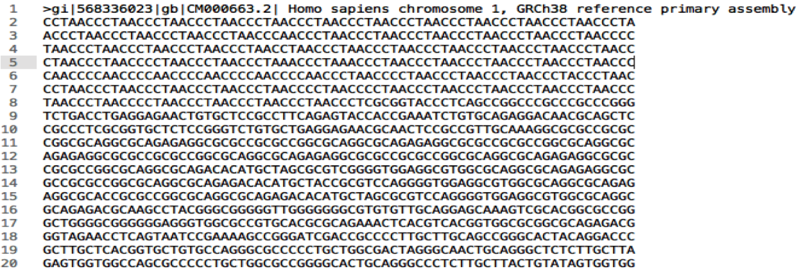
</div>


## GTF (Gene Transfer Format)

 <div align="center">
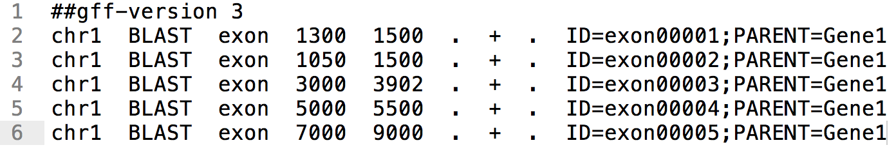
</div>

- Used to genome annotation.
- Stores position, feature (exon) and meta-feature (transcript/gene) information.

- **Importantly for Cell Ranger Count, only features labelled as exon (_column 3_) will be considered for counting signal in genes**
- **Many genomes label mitochondrial genes with _CDS_ and not _exon_ so these must be updated**


## Filter GTF

An optional step is to clean up the GTF and remove unwanted or low confident annotations. This can done manually by filtering the GTF *gene_biotype* column to key types, such as 'protein_coding' and 'lncRNA'. 

We could also use the **Cell Ranger mkgtf** function to remove these GTF rows using the attribute flag. Note this is a function from cellranger, not cellranger-atac. [Installation of cellranger](https://www.10xgenomics.com/support/software/cell-ranger/downloads){target="_blank"} is very similar to what we did here for cellranger-atac. Below is an example of how 10x generated the GTF for the Human reference.


```{shell, eval=FALSE}
cellranger mkgtf Homo_sapiens.GRCh38.ensembl.gtf \
Homo_sapiens.GRCh38.ensembl.filtered.gtf \
                   --attribute=gene_biotype:protein_coding \
                   --attribute=gene_biotype:lncRNA \
                   --attribute=gene_biotype:antisense \
                   --attribute=gene_biotype:IG_LV_gene \
                   --attribute=gene_biotype:IG_V_gene \
                   --attribute=gene_biotype:IG_V_pseudogene \
                   --attribute=gene_biotype:IG_D_gene \
                   --attribute=gene_biotype:IG_J_gene \
                   --attribute=gene_biotype:IG_J_pseudogene \
                   --attribute=gene_biotype:IG_C_gene \
                   --attribute=gene_biotype:IG_C_pseudogene \
                   --attribute=gene_biotype:TR_V_gene \
                   --attribute=gene_biotype:TR_V_pseudogene \
                   --attribute=gene_biotype:TR_D_gene \
                   --attribute=gene_biotype:TR_J_gene \
                   --attribute=gene_biotype:TR_J_pseudogene \
                   --attribute=gene_biotype:TR_C_gene
```


## Generate Cell Ranger mkref config file

Following filtering of your GTF to the required biotypes, we can use the Cell Ranger ATAC mkref tool to create our custom reference.

This requires a config file with key:value pairs. The *non_nuclear_contigs* pair indicates which reads are not part of nuclear genome and these reads will be excluded from peak calling. The *input_motifs* pair is optional and will trigger an additional TF enrichment analysis.

```{shell, eval=FALSE}
{
  organism: "human"
  genome: ["GRCh38"]
  input_fasta: ["/path/to/GRCh38/Homo_sapiens.GRCh38.dna.primary_assembly.fa.gz"]
  input_gtf: ["/path/to/Homo_sapiens.GRCh38.ensembl.filtered.gtf"]
  non_nuclear_contigs: ["chrM"]
  input_motifs: "/path/to/jaspar/motifs.pfm"
}

```


## Run Cell Ranger mkref 

The key:value pairs in the previous slide is saved as a file called **custom_GRCh38.config** and it is included in the *cellranger-atac mkref* function call. 
```{shell, eval=FALSE}

cellranger-atac mkref --config=/path/to/references/custom_GRCh38.config

```

# Output files {background-color="#23373B" .center .middle}


## Cell Ranger ATAC outputs


::: {.columns}

::: {.column width="50%"}
Having completed the Cell Ranger count step, the user will have created a folder, with the name set by the **--id** flag from the count command.

Within this folder there will be the **outs/** directory and descriptions of each file/folder can be found [here](https://www.10xgenomics.com/support/software/cell-ranger-atac/latest/analysis/outputs/understanding-output){target="_blank"}
:::

::: {.column width="50%"}
```{=html}
<pre class="tree">
outs/
├── analysis
├── cloupe.cloupe
├── cut_sites.bigwig
├── filtered_peak_bc_matrix/
├── filtered_peak_bc_matrix.h5
├── filtered_tf_bc_matrix/
├── filtered_tf_bc_matrix.h5
├── fragments.tsv.gz
├── fragments.tsv.gz.tbi
├── peak_annotation.tsv
├── peak_motif_mapping.bed
├── peaks.bed
├── possorted_bam.bam
├── possorted_bam.bam.bai
├── raw_peak_bc_matrix/
├── raw_peak_bc_matrix.h5
├── singlecell.csv
├── summary.csv
├── summary.json
└── web_summary.html
</pre>
```
:::

:::

## Output files - Fragments


::: {.columns}

::: {.column width="50%"}

::: {style="font-size: 70%;"}
- **fragments.tsv.gz/fragments.tsv.gz.tbi**: location of each fragment

  + each row display the location, cell barcode, and read counts (duplicates)

``` {.text code-line-numbers="false"}
chr1	10073	10327	CCACGTTCAGTAACTC-1	1	-
chr1	10083	10346	GCGAGAAGTCCACCAG-1	1	-
chr1	10097	10333	TTCGATTCATCTCTCG-1	1	-
```
:::

:::

::: {.column width="50%"}

```{=html}
<pre class="tree">
outs/
├── analysis
├── cloupe.cloupe
├── cut_sites.bigwig
├── filtered_peak_bc_matrix/
├── filtered_peak_bc_matrix.h5
├── filtered_tf_bc_matrix/
├── filtered_tf_bc_matrix.h5
├── <mark>fragments.tsv.gz</mark>
├── <mark>fragments.tsv.gz.tbi</mark>
├── peak_annotation.tsv
├── peak_motif_mapping.bed
├── peaks.bed
├── possorted_bam.bam
├── possorted_bam.bam.bai
├── raw_peak_bc_matrix/
├── raw_peak_bc_matrix.h5
├── singlecell.csv
├── summary.csv
├── summary.json
└── web_summary.html
</pre>
```
:::

:::

## Output files - Cell x Peak counts


::: {.columns}

::: {.column width="50%"}

::: {style="font-size: 70%;"}
- [**fragments.tsv.gz/fragments.tsv.gz.tbi**: location of each fragment]{style="color: grey;"}
- **filtered_peak_bc_matrix.h5**: count matrix with peaks as the rows and the cell barcodes as the columns 
  + the HDF5 format is optimized for big data and is efficient to work with programmatically

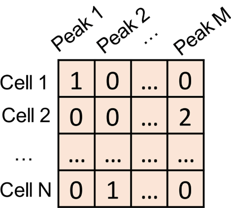{width=40% fig-align="center"}

:::

::: {style="font-size: 30%;"}
[Liu et al., Nat Mach Intel, 2021 ](https://pmc.ncbi.nlm.nih.gov/articles/PMC8223760/figure/F1/){target="_blank"}
:::


:::

::: {.column width="50%"}

```{=html}
<pre class="tree">
outs/
├── analysis
├── cloupe.cloupe
├── cut_sites.bigwig
├── filtered_peak_bc_matrix/
├── <mark>filtered_peak_bc_matrix.h5</mark>
├── filtered_tf_bc_matrix/
├── filtered_tf_bc_matrix.h5
├── fragments.tsv.gz
├── fragments.tsv.gz.tbi
├── peak_annotation.tsv
├── peak_motif_mapping.bed
├── peaks.bed
├── possorted_bam.bam
├── possorted_bam.bam.bai
├── raw_peak_bc_matrix/
├── raw_peak_bc_matrix.h5
├── singlecell.csv
├── summary.csv
├── summary.json
└── web_summary.html
</pre>
```
:::

:::

## Output files - Cell metadata


::: {.columns}

::: {.column width="50%"}

::: {style="font-size: 70%;"}
- [**fragments.tsv.gz/fragments.tsv.gz.tbi**: location of each fragment]{style="color: grey;"}
- [**filtered_peak_bc_matrix.h5**: count matrix with peaks as the rows and the cell barcodes as the columns]{style="color: grey;"}
- **singlecell.csv** contains metadata per cell (TSS_fragments, mitochondrial fragments, etc.)

:::

:::

::: {.column width="50%"}

```{=html}
<pre class="tree">
outs/
├── analysis
├── cloupe.cloupe
├── cut_sites.bigwig
├── filtered_peak_bc_matrix/
├── filtered_peak_bc_matrix.h5
├── filtered_tf_bc_matrix/
├── filtered_tf_bc_matrix.h5
├── fragments.tsv.gz
├── fragments.tsv.gz.tbi
├── peak_annotation.tsv
├── peak_motif_mapping.bed
├── peaks.bed
├── possorted_bam.bam
├── possorted_bam.bam.bai
├── raw_peak_bc_matrix/
├── raw_peak_bc_matrix.h5
├── <mark>singlecell.csv</mark>
├── summary.csv
├── summary.json
└── web_summary.html
</pre>
```
:::

:::


## Output files - Cloupe file


::: {.columns}

::: {.column width="50%"}

::: {style="font-size: 70%;"}
- [**fragments.tsv.gz/fragments.tsv.gz.tbi**: location of each fragment]{style="color: grey;"}
- [**filtered_peak_bc_matrix.h5**: count matrix with peaks as the rows and the cell barcodes as the columns]{style="color: grey;"}
- [**singlecell.csv** contains metadata per cell (TSS_fragments, mitochondrial fragments, etc.)]{style="color: grey;"}
- **cloupe.cloupe**: allows for quick visualization within the [10X Loupe browser software](https://www.10xgenomics.com/support/software/loupe-browser/latest){target="_blank"}
:::

:::

::: {.column width="50%"}

```{=html}
<pre class="tree">
outs/
├── analysis
├── <mark>cloupe.cloupe</mark>
├── cut_sites.bigwig
├── filtered_peak_bc_matrix/
├── filtered_peak_bc_matrix.h5
├── filtered_tf_bc_matrix/
├── filtered_tf_bc_matrix.h5
├── fragments.tsv.gz
├── fragments.tsv.gz.tbi
├── peak_annotation.tsv
├── peak_motif_mapping.bed
├── peaks.bed
├── possorted_bam.bam
├── possorted_bam.bam.bai
├── raw_peak_bc_matrix/
├── raw_peak_bc_matrix.h5
├── singlecell.csv
├── summary.csv
├── summary.json
└── web_summary.html
</pre>
```
:::

:::

## Output files - Web summary


::: {.columns}

::: {.column width="50%"}

::: {style="font-size: 70%;"}
- [**fragments.tsv.gz/fragments.tsv.gz.tbi**: location of each fragment]{style="color: grey;"}
- [**filtered_peak_bc_matrix.h5**: count matrix with peaks as the rows and the cell barcodes as the columns]{style="color: grey;"}
- [**singlecell.csv** contains metadata per cell (TSS_fragments, mitochondrial fragments, etc.)]{style="color: grey;"}
- [**cloupe.cloupe**: allows for quick visualization within the [10X Loupe browser software](https://www.10xgenomics.com/support/software/loupe-browser/latest){target="_blank"}]{style="color: grey;"}
- **web_summary.html**: QC summary that is often your first look at data quality
  + very important output and the focus of the next section
:::

:::

::: {.column width="50%"}

```{=html}
<pre class="tree">
outs/
├── analysis
├── cloupe.cloupe
├── cut_sites.bigwig
├── filtered_peak_bc_matrix/
├── filtered_peak_bc_matrix.h5
├── filtered_tf_bc_matrix/
├── filtered_tf_bc_matrix.h5
├── fragments.tsv.gz
├── fragments.tsv.gz.tbi
├── peak_annotation.tsv
├── peak_motif_mapping.bed
├── peaks.bed
├── possorted_bam.bam
├── possorted_bam.bam.bai
├── raw_peak_bc_matrix/
├── raw_peak_bc_matrix.h5
├── singlecell.csv
├── summary.csv
├── summary.json
└── <mark>web_summary.html</mark>
</pre>
```
:::

:::

## Output files - MEX format files

::: {.columns}

::: {.column width="50%"}

::: {style="font-size: 70%;"}
The **filtered_peak_bc_matrix/** folder contains the same peak × cell matrix as the .h5 file in MEX format: plain text files that can be read without special libraries.

  - matrix.mtx: sparse matrix of non-zero counts
  - peaks.bed: the rows (peaks)
  - barcodes.tsv: the columns (cell barcodes)

While we won't be using them here, you might see these on GEO or elsewhere and these can be read into R/Python for downstream processing. 
:::

:::

::: {.column width="50%"}
```{=html}
<pre class="tree">
outs/
├── analysis
├── cloupe.cloupe
├── cut_sites.bigwig
├── <mark>filtered_peak_bc_matrix/</mark>
├── filtered_peak_bc_matrix.h5
├── filtered_tf_bc_matrix/
├── filtered_tf_bc_matrix.h5
├── fragments.tsv.gz
├── fragments.tsv.gz.tbi
├── peak_annotation.tsv
├── peak_motif_mapping.bed
├── peaks.bed
├── possorted_bam.bam
├── possorted_bam.bam.bai
├── raw_peak_bc_matrix/
├── raw_peak_bc_matrix.h5
├── singlecell.csv
├── summary.csv
├── summary.json
└── web_summary.html
</pre>
```
:::

:::


# Web Summary QC {background-color="#23373B" .center .middle}


## QC outputs

Assessment of the overall quality of a scATAC-seq experiment after Cell Ranger can give our first chance to dig into the quality of your dataset and gain insight any issues we might face in data analysis.


## QC is essential

::: {.columns}

::: {.column width="50%"}

::: {style="font-size: 70%;"}
There are many potential issues which can arise in scATAC-seq data including:

- Ambient DNA contamination
- Empty droplets
- Low quality cells (dead or dying)
- Doublets 


:::

:::

::: {.column width="50%"}
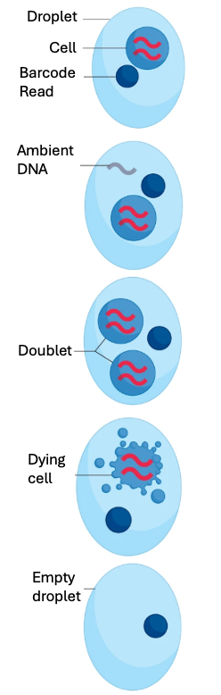{width=40% fig-align="center"}
:::

:::
::: {.absolute bottom="0" left="0" style="font-size: 30%;"}
[Heumos et al., Nat Rev Genetics, 2023 ](https://www.nature.com/articles/s41576-023-00586-w){target="_blank"}
:::


## Metrics and Web Summary

Cell Ranger will also output summaries of useful metrics as a text file _(web_summary.html)_ and as a intuitive web-page.

Metrics include:

- Counts/UMIs per cell.
- Number of cells detected.
- Sequencing saturation
- t-sne/UMAP with default clustering.
- TSS enrichment
- Insert size distribution


## Metrics and Web Summary

While it often takes a deeper look into the results to understand QC issues, the Cell Ranger summary can give our first insight into key issues we might face.

<br>
<br>

We will be looking at the web summary generated from a PBMC dataset with ~500 cells from a healthy human donor. The full experiment details can be found on the 10X website [here](https://www.10xgenomics.com/datasets/500-peripheral-blood-mononuclear-cells-pbm-cs-from-a-healthy-donor-next-gem-v-1-1-1-1-standard-2-0-0){target="_blank"} and the web summary is in the course materials [here](../data/web_summary_pbmc500.html){target="_blank"}.


## Web Summary overview

::: {.columns}

::: {.column width="50%"}

::: {style="font-size: 70%;"}
The web summary html file contains an interactive report describing the most essential QC for your single cell experiment.
<br>
<br>
It prominently displays warnings at the top to indicate metrics outside the expected ranges.
<br>
<br>
The summary also contains useful information on the input files and the versions used in this analysis for later reproducibility.
:::

:::

::: {.column width="50%"}
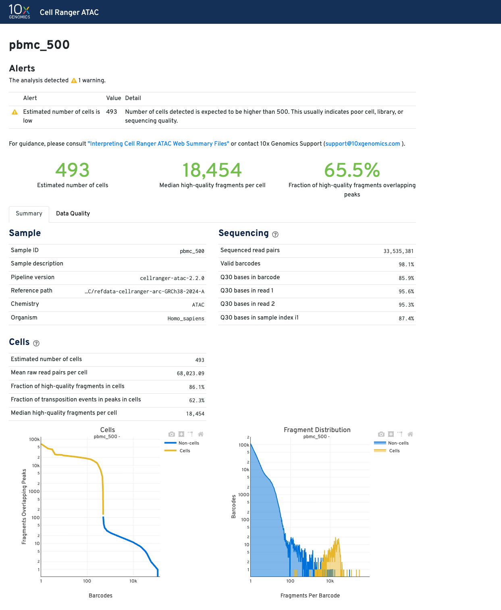{width=100% fig-align="center"}
:::

:::

::: {.absolute bottom="0" left="0" style="font-size: 30%;"}
[link to full summary](../data/web_summary_pbmc500.html){target="_blank"}
:::

## Sample Summary


::: {style="font-size: 70%;"}
The first thing we can review is the **Sample** information panel.
As most people do not run Cell Ranger themselves this is important to check it matches expectations.

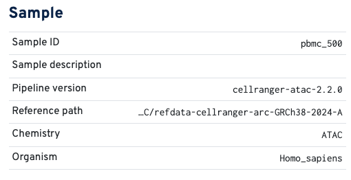{width=40% fig-align="center"}

- Sample ID - Sample name (Assigned in **cellranger-atac count**)
- Chemistry - The 10x chemistry used
- Reference path - path on system to pre-built reference file from command
- Pipeline Version - Version of Cell Ranger used

:::


## Sequencing panel

::: {style="font-size: 70%;"}
The **Sequencing** panel highlights information on the quality of the Illumina sequencing.

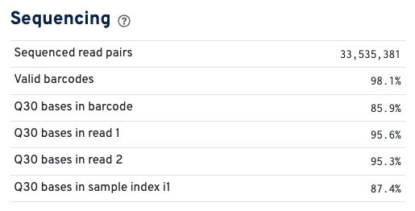{width=40% fig-align="center"}

- Sequenced read pairs - Total read pairs
- Valid barcodes - fraction of read pairs that match an expected 10x barcode from the whitelist (> 75%)
- Q30 bases - percent of bases with Q-score > 30 

:::


## Cells panel

::: {style="font-size: 70%;"}
The **Cells** panel highlights some of the most important metrics, including some that are repeated and placed as the headline of the report.

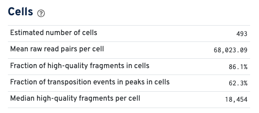{width=40% fig-align="center"}


- Estimated Number of Cells - Total number of barcodes associated to at least one cell.
- Mean raw read pairs per cell -  Average reads in each cell
- Fraction of high-quality fragments in cells - fraction of high quality fragments (map to genome, mapQ > 30, no chimeric or duplicate) with valid cell barcode (>40%)
- Fraction of transposition events in peaks in cells - fraction of Tn5 cut sites (fragment ends) that come from a valid cell barcode and fall within a peak (>15%)
- Median fragments per Cell - Median number of fragments per valid cell barcode
:::


## Barcode rank (knee) plot 

::: {.columns}

::: {.column width="50%"}

::: {style="font-size: 70%;"}


The **Cells** panel also includes an interactive knee plot:

- On the x-axis, the barcodes ordered by the most frequent on the left to the least frequent on the right
- On the y-axis, the number of fragments that overlap a peak for each barcode.
- Highlighted in yellow are the barcodes marked as associated to cells.

:::
:::

::: {.column width="50%"}
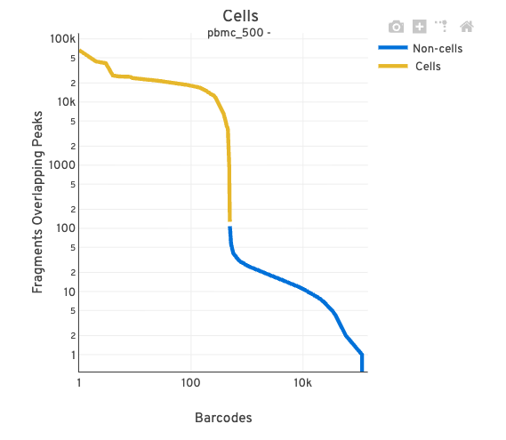

:::

:::

## Barcode rank (knee) plot 

::: {.columns}

::: {.column width="50%"}

::: {style="font-size: 70%;"}


Cell Ranger ATAC uses a two step process to define cell-associated barcodes

- First, problematic barcodes are removed (e.g. mutliple barcodes).
- Second, a model is fitted to separate signal from noise.
- A detailed explanation is [here](https://www.10xgenomics.com/support/software/cell-ranger-atac/latest/algorithms-overview/algorithms-overview#cell-calling-a2c13c){target="_blank"}

If required, a **--force-cells** flag can be used with _cellranger-atac count_ to identify a specific number of cell-associated barcodes.


:::
:::

::: {.column width="50%"}


:::

:::

## Cell vs Non-cell Fragment Distribution  

::: {.columns}

::: {.column width="50%"}

::: {style="font-size: 70%;"}


When looking at the distribution of fragments per barcode, a good QC sample shows a separation between barcodes identified as cells compared to non-cells.

<br>

Our PBMC data is an example of this separation.
:::
:::

::: {.column width="50%"}
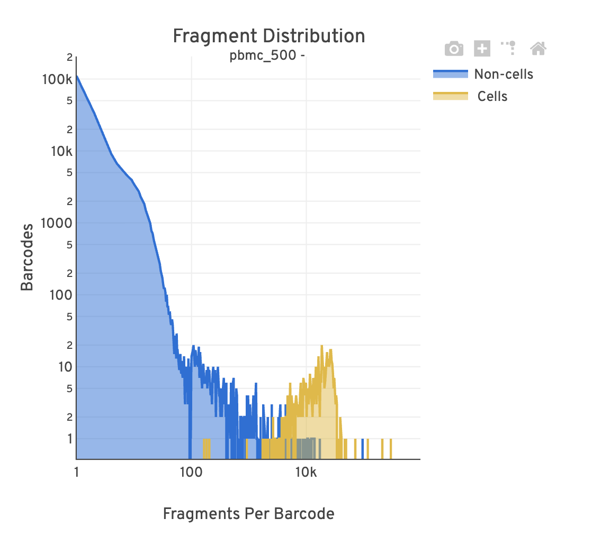

:::

:::

## Poor QC example

The barcode rank plot and fragment distribution also act as good QC tools to investigate differing types of single cell failure.

Whereas our previous barcode rank plot represented a good sample, differing knee plot patterns can be indicative of specific problems with the single cell protocol. 


## Poor QC example

::: {style="font-size: 70%;"}
Commonly a problematic sample will show a gradual, rounded curve around the expected number of cells instead of a steep cliff, and weak separation in the fragment distribution.

This is often indicative of technical problems, such as high ambient tagmented DNA from dying or broken nuclei that is captured by empty droplets or a failure in the integration of oil, beads and samples (wetting failure)  

This is indicated in the plots below: 
:::

::: {.columns}

::: {.column width="50%"}
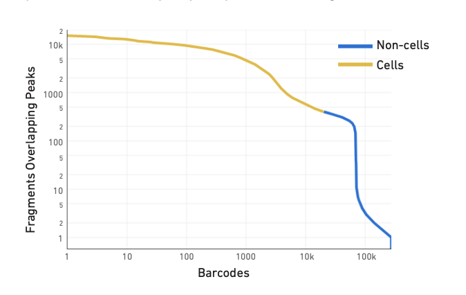
:::

::: {.column width="50%"}
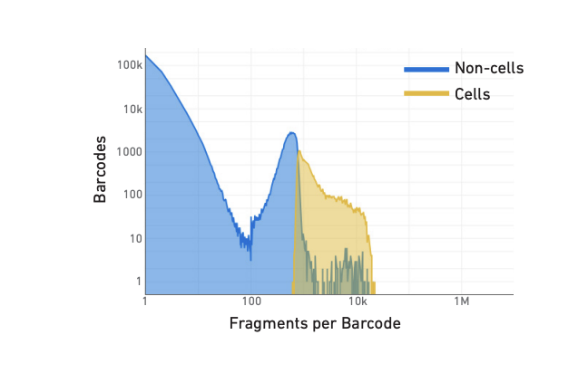
:::

:::

## Cell Clustering Panel

::: {style="font-size: 70%;"}
The **Cell Clustering** panel shows t-SNE plot with basic clustering of peak counts from valid cell barcodes.

Assuming different cell types are expected, we would hope to see separation between clusters. We will do a more in depth clustering analysis later on, but the lack of any cluster separation here can be an early indication of QC issues. 

We also hope that our clusters aren't driven by the number of fragments in a cell, and this would be seen in the t-SNE on the right. 
:::

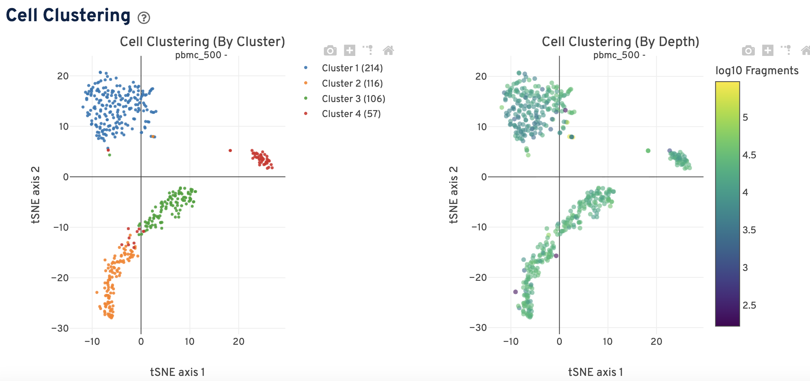{fig-align="center" style="max-width: none; max-height: none; width: 70%;"}

## Library Complexity Panel

::: {style="font-size: 70%;"}
The **Library Complexity** panel (in the Data Quality tab) shows the percent duplicates and a saturation curve showing median fragments per cell over successive downsampling of the data. 

With a reasonable number of fragments per cell, we expect this number to be >30%, indicating a reasonable level of saturation. A lower value here might suggest that deeper sequencing could help. 
:::

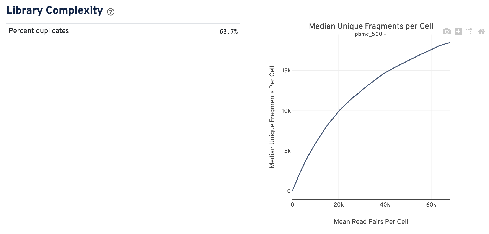{fig-align="center" style="max-width: none; max-height: none; width: 70%;"}

## Mapping Panel

::: {style="font-size: 70%;"}
The **Mapping** panel shows the mapping rate (ideally > 85%) and the percent of unmapped reads (<5%), in addition to a few key ATAC-seq metrics. 

- Fragments in nucleosome-free regions - percent of fragments passing all mapping filters with length < 124 bases (>40%)
- Fragments flanking a single nucleosome - fragments between 124 and 296 bases (i.e. the first bump in the plot below). This should be lower than nucleosome-free, but still a meaningful number of reads to indicate expected chromatin structure. 
:::

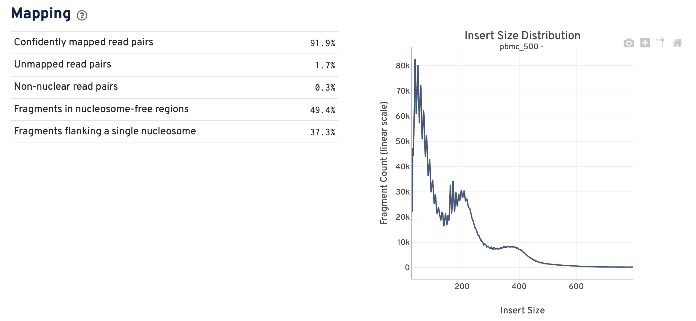{fig-align="center" style="max-width: none; max-height: none; width: 70%;"}


## Targeting Panel

::: {style="font-size: 70%;"}
The **Targeting** panel shows information related to the pile-up of reads across the genome. 

- Cell ranger ATAC calls peaks with all fragments that have a valid barcode, including those from empty droplets. 
- With the _--peaks_ option on _cellranger-atac count_, a bed file of user-provided peaks can be used as well. 
- We would hope for >45k peaks that cover between 2-20% of the genome. With only 500 cells, our example is a little low, but more cells would likely help here. 

:::

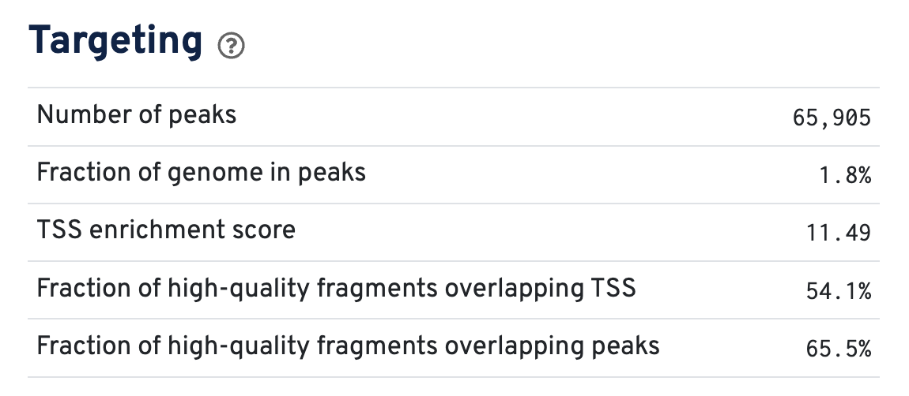{fig-align="center" style="max-width: none; max-height: none; width: 50%;"}

## Targeting Panel

::: {.columns}

::: {.column width="35%"}
::: {style="font-size: 70%;"}
A high quality dataset shows significant enrichment of fragments over TSS and peak regions

Ideally, **TSS enrichment** score would be greater than 5, and the **fraction of fragments overlapping TSS and peaks** would both be above 15%. 

Low numbers here could be a result of ambient DNA/dying cells, or shallow sequencing depth. 


:::
:::

::: {.column width="65%"}
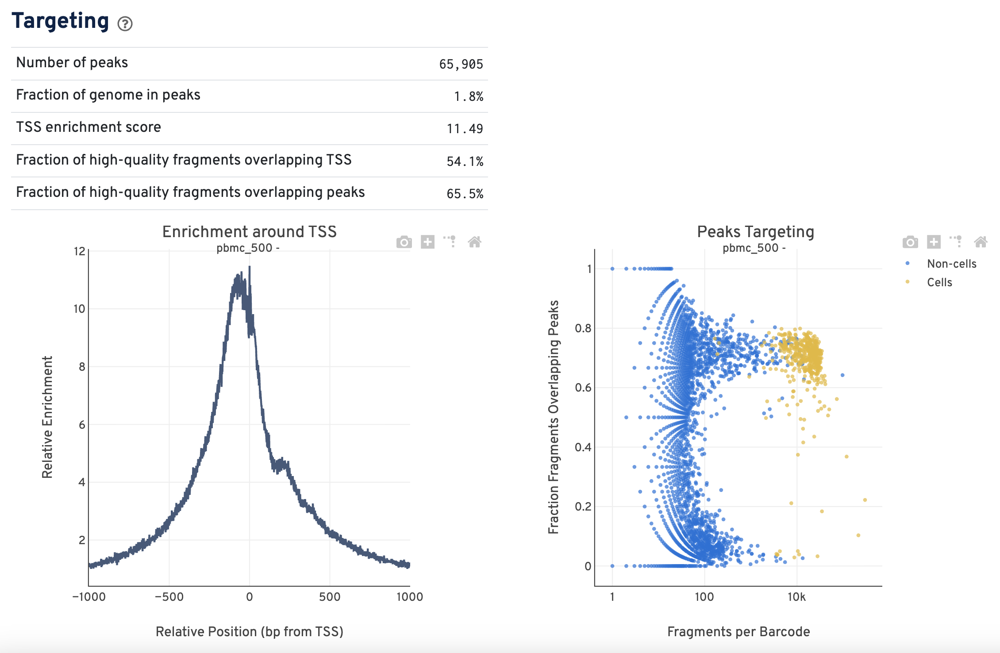
:::

:::

## Poor QC example continued...

::: {style="font-size: 70%;"}
These plots can very quickly indicate QC problems. 

:::
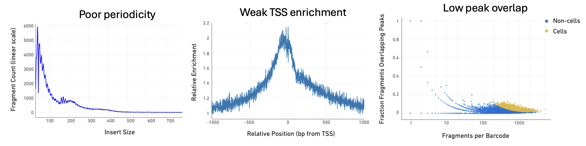{fig-align="center" style="max-width: none; max-height: none; width: 100%;"}

::: {style="font-size: 70%;"}
**It's important to note** that the targets for these QC metrics aren't hard cut-offs. They are meant to highlight potential issues to be aware of and potentially account for during downstream analysis.

Oftentimes we can employ strategies to get meaningful insights from problematic data.
:::


## Next steps

Fingers crossed there's no QC issues. 

Often at this step we wouldn't make any decisions unless there is a clear complete failure. This is an important first step in setting expectations/preparing for what you may need to do for the dataset.

Next we will read the data into R and into a format that we can interrogate further.

# Reading data into R with Signac {background-color="#23373B" .center .middle}

## Signac for Downstream Analysis

Here we will use [Signac](https://stuartlab.org/signac/){target="_blank"}, which is an R software package that facilitates most of the downstream processing steps.

Signac is an extension of the well-supported Seurat ecosystem used for scRNA-seq and integrates easily with multiome (RNA + ATAC) analysis. 

::: {.absolute bottom="0" left="0" style="font-size: 30%;"}
[Stuart et al., Nat Methods, 2021 ](https://www.nature.com/articles/s41592-021-01282-5){target="_blank"}
:::

## Software Options for Downstream Analysis

Other popular options include:

- [ArchR](https://www.archrproject.com/){target="_blank"} (R package)
- [SnapATAC2](https://snapatac2.scverse.org/){target="_blank"} (Python package)

Both have advantages handling large data compared to Signac.

DOUG: ArchR better links to EpiRegulon and has maybe has better documentation (snapatac too)
QC concepts would be the same so emphasize that 

::: {.absolute bottom="0" left="0" style="font-size: 30%;"}
[Granja et al., Nat Rev Genetics, 2021 ](https://www.nature.com/articles/s41588-021-00790-6){target="_blank"}
<br>
[Zhang et al., Nat Methods, 2024 ](https://www.nature.com/articles/s41592-023-02139-9){target="_blank"}
:::


## Reading data into Signac

::: {.columns}

::: {.column width="50%"}

::: {style="font-size: 70%;"}

Let's remember what outputs we have fromCell Ranger ATAC

The key files we will need are:

- **fragments.tsv.gz**: location of each fragment
- **filtered_peak_bc_matrix.h5**: counts over peaks from pooled fragments
- **singlecell.csv**: cell metadata

:::

:::

::: {.column width="50%"}

```{=html}
<pre class="tree">
outs/
├── analysis
├── cloupe.cloupe
├── cut_sites.bigwig
├── filtered_peak_bc_matrix/
├── <mark>filtered_peak_bc_matrix.h5</mark>
├── filtered_tf_bc_matrix/
├── filtered_tf_bc_matrix.h5
├── <mark>fragments.tsv.gz</mark>
├── <mark>fragments.tsv.gz.tbi</mark>
├── peak_annotation.tsv
├── peak_motif_mapping.bed
├── peaks.bed
├── possorted_bam.bam
├── possorted_bam.bam.bai
├── raw_peak_bc_matrix/
├── raw_peak_bc_matrix.h5
├── <mark>singlecell.csv</mark>
├── summary.csv
├── summary.json
└── web_summary.html
</pre>
```
:::

:::


## Reading data into Signac

With these files we can build the Seurat object that will contain our Cell Ranger data and be used for downstream analysis. 

First, we load the Signac and Seurat libraries. 
```{r}
library(Signac)
library(Seurat)

```

## Reading data into Signac

The *singlecell.csv* file is then read in as a dataframe that has the cell barcodes as rows and metadata categories as columns. 
```{r,echo=T}
metadata <- read.csv(
  file = "../data/pbmc500_singlecell.csv",
  header = TRUE,
  row.names = 1
)
metadata[1:3, ]

```


## Reading data into Signac

By looking at the column names, we can see all of the available metadata. 


```{r}
colnames(metadata)
```

## Reading data into Signac

The *filtered_peak_bc_matrix.h5* file contains the peak counts per cell, and we read it in with the Seurat *Read10X_h5* function, and subset to the standard chromsomes.

This creates a sparse matrix object with the peak counts.

```{r,echo=T}
counts <- Read10X_h5(filename = "../data/pbmc500_filtered_peak_bc_matrix.h5")
std_chr   <- paste0("chr", c(1:22, "X", "Y"))
peak_chr  <- as.character(seqnames(StringToGRanges(rownames(counts), sep = c(":", "-"))))
counts    <- counts[peak_chr %in% std_chr, ]
counts[1:5, 1:3]
```

## Reading data into Signac

The counts and a path to the fragments file are provided to the *CreateChromatinAssay* function from **Signac** to create a *ChromatinAssay* object.

We can set the 'min.cells' and 'min.features' arguments to filter out low quality peaks and cells. 
```{r,echo=T, eval=F}
# NOTE: need signac v1.16 to correctly read this in

chrom_assay <- CreateChromatinAssay(
  counts = counts,
  sep = c(":", "-"),
  fragments = "../data/pbmc500_fragments.tsv.gz",
  min.cells = 10,
  min.features = 200
)

class(chrom_assay)
```


## Reading data into Signac

Finally, the *ChromatinAssay* object and the metadata dataframe are used to create a Seurat object with an assay called 'peaks' that contains our peak counts. 

```{r,echo=T, eval=F}
pbmc <- CreateSeuratObject(
  counts = chrom_assay,
  assay = "peaks",
  meta.data = metadata
)

pbmc
```

## Updating the fragments path 

The individual fragment information is not kept in memory within the object, we just have a pointer to the file path we provided.

So if the fragment file has moved, we would need to update that pointer with the *UpdatePath* function. 
```{r,echo=T, eval=F}
frags <- Fragments(pbmc)  
frags_updated <- UpdatePath(
  frags[[1]],
  new.path = "~/Downloads/pbmc500_fragments.tsv.gz"
)
Fragments(pbmc) <- NULL
Fragments(pbmc) <- frags_updated
```

## Updating the fragments path 

The fragment object contains the md5 hash of the file, so if the fragments file is different from the current pointer, you will get an error. 
```{r, echo=T, eval=F}
frags_updated_bad <- UpdatePath(
  frags[[1]],
  new.path = "~/Downloads/atac_pbmc_500_nextgem_fragments.tsv.gz"
)
```

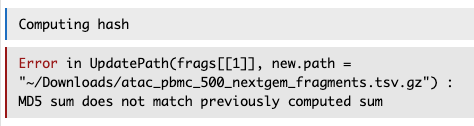{.nostretch fig-align="left" width="70%"}

## Exercises

The following few slides show you how to structure exercise slides.

We often have several exercise slides per session. So you can just copy and paste and change the directory to the appropriate name. All 3 file types are made from you single exercise qmd.

## Time for an exercise!

??? exercise description here?? [here](../../exercises/exercises/MyExercise1_exercise.html){target="_blank"}

## Answers to exercise

Answers can be found [here](../../exercises/answers/MyExercise1_answers.html){target="_blank"}

## Exercise again

So we can have some more sections here describing some new important topic

Then more exercises

## Time for an exercise!

??? exercise description here?? [here](../../exercises/exercises/MyExercise2_exercise.html){target="_blank"}

## Answers to exercise

Answers can be found [here](../../exercises/answers/MyExercise2_answers.html){target="_blank"}
