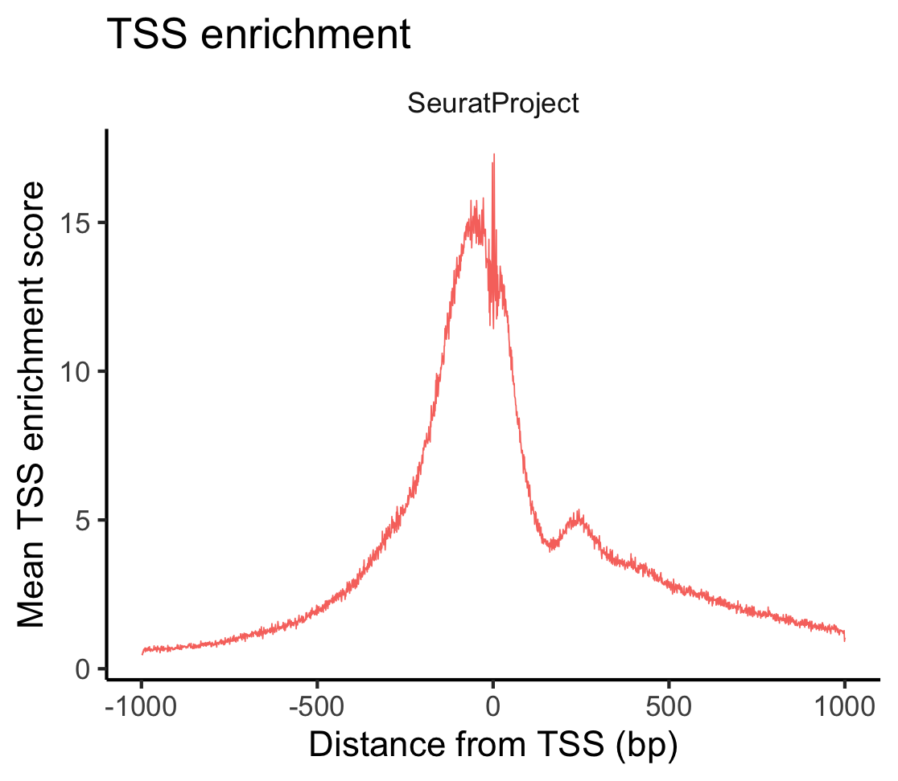
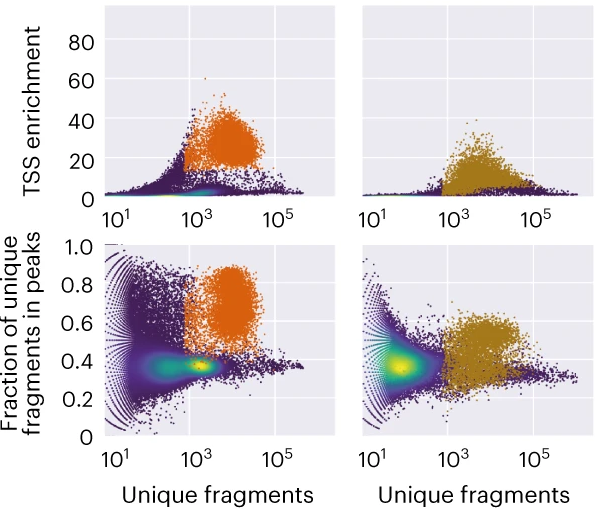

```{r setup, include=FALSE}
suppressPackageStartupMessages(require(knitr))
knitr::opts_chunk$set(echo = TRUE, tidy = T)
```

::: {.content-hidden when-format="revealjs"}
# Single-cell ATAC-seq: QC and Preprocessing
:::

## Overview

- [Recap](#recap)
- [scATAC QC metrics](#scatac-qc-metrics)
- [Filtering cells](#filtering-cells)
- [Normalization with TF-IDF](#normalization-with-tf-idf)
- [Feature selection](#feature-selection)

## Recap

?? Brief recap of Session 1 — the fragment file, the peak-by-cell matrix and the Signac ChromatinAssay inside a Seurat object. Link to the relevant Session 1 sections once they exist ??

- [Session 1](Session1.html)

# scATAC QC metrics {background-color="#23373B" .center .middle}

## scATAC QC metrics

There are many ways we check 

Some of the QC metrics we are interested in are common across single cell methods i.e. nCount, percent.mt etc

Many oF the most important are ATAC specific, and will be recognizable to those that have done bulk ATACseq. These often are readouts for tagmentation efficiency. 

We need to use a combination of these metrics to answer the most important question: *Can I trust my data?*


## Key Metrics

Instead we use:

| Metric | What it detects |
|---|---|
| TSS enrichment score | Signal quality around annotated TSSs |
| Nucleosome signal | Fragment size periodicity |
| FRiP (fraction of reads in peaks) | Signal-to-noise ratio |
| Blacklist ratio | Contaminating signal from problematic regions |
| Total fragment count | Sequencing depth |
| Doublets | Multiple cells in a single droplet |

We will calculate and review all these metrics before considering any filtering. 

## scATAC data
 
We will be using the [500 cell PBMC dataset from 10X](https://www.10xgenomics.com/datasets/500-peripheral-blood-mononuclear-cells-pbm-cs-from-a-healthy-donor-next-gem-v-1-1-1-1-standard-2-0-0) we looked at earlier. This is relatively small but good quality dataset. Lets make sure we have it in our R session. In the process we will remove non-standard chromsomes.  

```{r}
library(Signac)
library(Seurat)

```
 
```{r, eval=F}
# read in h5 file
library(Signac)
library(Seurat)

counts <- Read10X_h5(filename = "~/Desktop/ATAC.data.500.cell/atac_pbmc_500_nextgem_filtered_peak_bc_matrix.h5")

std_chr   <- paste0("chr", c(1:22, "X", "Y"))
peak_chr  <- as.character(seqnames(StringToGRanges(rownames(counts), sep = c(":", "-"))))
counts    <- counts[peak_chr %in% std_chr, ]

metadata <- read.csv(
  file = "~/Desktop/ATAC.data.500.cell/atac_pbmc_500_nextgem_singlecell.csv",
  header = TRUE,
  row.names = 1
)

chrom_assay <- CreateChromatinAssay(
  counts = counts,
  sep = c(":", "-"),
  fragments = "~/Desktop/ATAC.data.500.cell/atac_pbmc_500_nextgem_fragments.tsv.gz",
  min.cells = 10,
  min.features = 200
)

pbmc <- CreateSeuratObject(
  counts = chrom_assay,
  assay = "peaks",
  meta.data = metadata
)
```

```{r}
pbmc <- readRDS("data/pbmc_start.rds")

```

```{r repointFragments, include=FALSE, purl=FALSE}
# The saved object records the fragment file's absolute path on the machine that
# built it. When a copy sits in data/ (CI downloads it there), point the object
# at that copy so fragment-based steps (TSS enrichment, fragment histogram,
# AMULET) can find it; otherwise keep the recorded path.
frag_local <- "data/atac_pbmc_500_nextgem_fragments.tsv.gz"
if (file.exists(frag_local)) {
  frags <- UpdatePath(Fragments(pbmc)[[1]], new.path = frag_local)
  Fragments(pbmc) <- NULL
  Fragments(pbmc) <- frags
}
```

# TSS Enrichment Score {background-color="#23373B" .center .middle}

## What is TSS Enrichment?

The purpose of ATAC is to detect open chraomtin regions, so good quality ATAC is enriched near open chromatin sites like Transcription Start Sites (TSS). A cell with a **high TSS enrichment score** have many reads at TSSs — evidence of good signal-to-noise.

A **low score** suggests:

- Dead or dying cells
- Ambient DNA contamination
- Poor tagmentation efficiency


## How to calculate TSS enrichment?

::: {.columns}

::: {.column width="50%"}
**Signac definition**: *It is calculated by aggregating the signal at all TSS +/- 1kb and then normalizing against the signal at the flank of that range. The final TSSe score is the enrichment at the center of this range*

Often the whole metaplot is visualized.

A key note is that TSSE is calculated slightly differently by different tools. ArchR and [*ENCODE*](https://www.encodeproject.org/data-standards/terms/) for example, opt for +/- 2kb instead.

:::

::: {.column width="50%"}

:::

:::

## TSS enrichment with Signac

The first step to calculating TSS enrichment is loading in a reference gene annotation with the TSS regions. The gene ranges from which to specify TSS can be provided directly as a GTF file. Here though we grab the appropriate information from R package database *AnnotationHub*. In this case we will grab the ENSEMBL version of human gene annotation. 

```{r}

library(AnnotationHub)
ah <- AnnotationHub()

query(ah, "EnsDb.Hsapiens.v98")
ensdb_v98 <- ah[["AH75011"]]

annotations <- GetGRangesFromEnsDb(ensdb = ensdb_v98)

head(annotations)
```

## TSS enrichment

Next we need to amend the annotations to be using UCSC-style chromosomes. We can then add the annotation to Signac object. 

```{r}

seqlevels(annotations) <- paste0('chr', seqlevels(annotations))
genome(annotations) <- "hg38"

Annotation(pbmc) <- annotations
```

## TSS enrichment distribution

We can first calculate the score, then plot it. 

```{r tss_enrichment_violin}

pbmc <- TSSEnrichment(object = pbmc)

VlnPlot(object = pbmc,
  features = c('TSS.enrichment'))
```


## TSS enrichment metaplot

If you want to also draw the metaplot itself you will have to recalculate the TSS enrichment. By default this function does not save an aggregated matrix of ATAC reads x position across the TSS to save memory. By setting the *fast* argument to FALSE, this matrix is stored and can then be sued to generate the TSS metaplot. These can be nice to compare between samples.  

```{r tss_enrichment_metaplot}

pbmc <- TSSEnrichment(object = pbmc, fast = F)

TSSPlot(pbmc)

```

## TSS enrichment metaplot

It can also be useful to review potential thresholds by splitting the data using QC values like TSS enrichment. We can directly create a new metadata slot, then use that when we plot. 


```{r tss_enrichment_metaplot2}

pbmc$TSSE.group <- ifelse(pbmc$TSS.enrichment > 4, "High", "Low")

TSSPlot(pbmc, 
        group.by = "TSSE.group")
```


# Nucleosome Signal {background-color="#23373B" .center .middle}

## Fragment Size Periodicity

In good quality ATAC-seq libraries, fragment sizes show a characteristic **ladder pattern**. This fragment length periodicity happens because Tn5 can only cut between nucleosomes. The relative abundance of these groups is also indicative of sample quality. 

- **< 147 bp** — nucleosome-free region (NFR); open chromatin
- **~200 bp** — mono-nucleosomal
- **~400 bp** — di-nucleosomal
- **~600 bp** — tri-nucleosomal

## Nucleosome Signal in Signac

Signac calculates a **nucleosome signal** score per cell: the ratio of mono-nucleosomal to sub-nucleosomal (NFR) fragment counts. If a cell has a high nucleosome signal this means you're fragments are larger and less digested.

## Nucleosome Signal in Signac

::: {.columns}

::: {.column width="50%"}

High values for nucleosome signal can indicate several QC problems:
* Most of the time it is low tagmentation efficiency
* Dying/damaged cells


:::

::: {.column width="50%"}

```{r nucleosome_signal}
pbmc <- NucleosomeSignal(object = pbmc)

VlnPlot(pbmc, features = "nucleosome_signal")
```

:::

## Fragment ladder

We can also visualize the fragment ladder as a histogram through Signac using *FragmentHistogram*. If you can't see any ladder you likely have a failed library.

```{r nucleosome_fragment}
FragmentHistogram(
  object = pbmc
)
```

## Fragment ladder

As we did with TSSE we can split our plots up using our nucleosome signal.

```{r nucleosome_fragment2}
pbmc$nucleosome_group <- ifelse(pbmc$nucleosome_signal > 2,
                                 "NS > 2", "NS < 2")
FragmentHistogram(
  object   = pbmc,
  group.by = "nucleosome_group"
)
```

# Fraction of Reads in Peaks (FRiP) {background-color="#23373B" .center .middle}

## Fraction of Reads in Peaks (FRiP)

Cell Ranger has called peaks for us. **FRiP** measures the proportion of a cell's fragments that overlap these called peaks. As with TSSE, a high proportion of reads in peaks indicates efficient ATAC. It also suggests that you have good peak calling. 

- High FRiP → reads concentrated at accessible sites → good signal-to-noise
- Low FRiP → reads scattered across the genome → likely low-quality cell, ambient DNA or over-tagmentation. 

## Fraction of Reads in Peaks (FRiP)

When you read Cell Ranger objects into Signac several metrics come for free. This includes:

1. passed_filters - Total number of high-quality, usable fragments that passed filtering for each cell
2. peak_region_fragments - Total number of fragments falling within the peaks called for that cell

We can easily calcualte FRiP from this.

```{r frip}
pbmc$pct_reads_in_peaks <- pbmc$peak_region_fragments /
                            pbmc$passed_filters * 100
```

There is also a FRiP() function if you decide to recalculate peaks or use a non-10X technology. 

## Fraction of Reads in Peaks (FRiP)

We can then visualize this again with VlnPlot. 

```{r, frip2}
VlnPlot(pbmc, features = "pct_reads_in_peaks")
```


# Blacklist/Exclusion regions {background-color="#23373B" .center .middle}


## Blacklist/Exclusion regions

Blacklist/Exclusion regions are genomic intervals with consistently anomalous signal in NGS experiments — caused by repetitive elements, satellite DNA, and regions of poor mappability. These regions are specifically problematic because the references rarely contain a true representation of the repeats, as it can be difficult to resolve.

A high blacklist ratio often points to low-quality or misassigned barcodes


::: {.callout-note}
There is an increasing prevalence for these areas of the genome to be called exclusion regions or high-signal artifacts as it's more inclusive and precise language.  
:::

## Blacklist/Exclusion regions

Here is an example for the Human Centromeric alpha satellite:

* Cells: ~0.5 million copies per genome.
* Reference (hg19): 3Mb of empty N's per chromosome, with a few copies at each boundary.
* Result: Huge inflation of signal at these boundary regions across NGS technologies. 

These regions are both manually and computationally curated by systematic review of 100s of different cell types. Some regions have 1000+ times the signal versus expected background. 

## Blacklist/Exclusion regions

Older versions of Cell Ranger used to report the blacklist fragments in *blacklist_region_fragments*. This is not the case anymore so you need to calculate it. 

A comprehensive list of artifactual regions are also available in the [excluderanges](https://www.bioconductor.org/packages/release/data/annotation/html/excluderanges.html) R package.

Several are also included in Signac. The PBMC dataset we are using was mapped to hg38, so lets look at *Signac::blacklist_hg38*.

## Blacklist/Exclusion regions

**hg38** 
* 636 regions
* Median is 10 kb, but largest is >30Mb

```{r}
Signac::blacklist_hg38
```


## Calculating Blacklist/Exclusion proportion

::: {.columns}

::: {.column width="50%"}

```{r}
pbmc$excl_prop <- FractionCountsInRegion(
  object = pbmc,
  assay = 'peaks',
  regions = blacklist_hg38
)
```
:::

::: {.column width="50%"}

```{r}
VlnPlot(pbmc, features = "excl_prop")
```
:::

:::

# Doublets {background-color="#23373B" .center .middle}

## Doublets

Doublets occur when multiple cells/nuclei are in the same droplet. The worst case scenario for this is that these they come from wildly different cell types, resulting in a heterotypic intermediate profile. 

Doublets typically occur when a large number of cells are loaded or if there is inefficient disaggregation. 

Often a simple filter of cells with high ca will remove most doublets. That said we can use specialist tools to help. OUr preferred tool is **scDblFinder**.

## scDblFinder methods

scDblFinder has two methods that we can use:

1. scDblFinder
  - Originally developed for RNAseq, but has settings good for ATAC-seq
  - Simulates doublets using pairs of cells, and then tests if real cells are similar to simulated cells. 
  - Sensitive to heterotypic duplicates

2. AMULET
  - ATAC-specific
  - Counts genome positions and looks for anywhere with >2 counts
  - Sensitive to heterotypic and homotypic duplicates

As both these methods use very different approaches they are seen as complementary and often both can be run. 

## scDblFinder 

scDblFinder is a Bioconductor pacakge, so we have to coerce our Signac object into the Bioconductor specific SingleCellExperiment object type. 

```{r}

library(scDblFinder)
library(SingleCellExperiment)
library(GenomicRanges)

sce <- as.SingleCellExperiment(pbmc, assay = "peaks")
```

## scDblFinder 

Before we can run scDblFinder we must first set a seed. This is important for reproducibility, as the doublet simulation process is random. 

We also use several ATAC-specific arguments:
* aggregateFeatures = TRUE - Relative to scRNA, scATAC has many more features, with each having lower signal. For ATAC we aggregate signal at many features (peaks) together. 
* nfeatures = 25 - The feature are aggregated into meta-features. We can then choose how mnay meta-features to use. 
* processing = "normFeatures" - As we have a low number of meta-features, we can stick to basic normalization without full dimension reduction. 
* dbr = NULL - You can provide an expected doublet rate. For scATAC it is typically low, especially this kind of PBMC data. 


```{r}
set.seed(42)  
sce <- scDblFinder(
  sce,
  aggregateFeatures = TRUE,
  nfeatures         = 25,
  processing        = "normFeatures",
  dbr               = NULL          
)

```

## AMULET 

While standard scDblFinder works from the count matrix, AMULET needs to check all the frsgment files, as it looking genome wide for anywhere with >2 reads. As a result this can be a long and memory-intensive process

First we will grab the path to the fragment file.

```{R}

frag_path <- GetFragmentData(Fragments(pbmc)[[1]], slot = "path")

```

## AMULET

We also want to mask any genome ranges that are considered problems because they have high chances of inappropriate mapping i.e. mitochondria, sex chromosomes, repeats and exclude ranges.

Most of these are easy to do/we laready have loaded in. We just need to grab extra repeat information by getting the RepeatMasker for our genome. We can use AnnotationHub again. 

```{r}

library(AnnotationHub)
ah <- AnnotationHub()

rm_q <- query(ah, c("RepeatMasker", "hg38"))
mcols(rm_q)[, c("title", "rdataclass", "sourceurl")]
rmsk <- rm_q[[which(rm_q$rdataclass == "GRanges")[1]]]
```

## AMULET

Lets now create a combined set of exclusion ranges comprising of RepeatMasker, non-canonical chromosomes and the exclude ranges from ENCODE.

```{r}

plain <- function(gr) GRanges(as.character(seqnames(gr)), ranges(gr))

excl <- reduce(c(
  GRanges(c("chrM", "chrX", "chrY"), IRanges(1L, width = seqlengths(Annotation(pbmc))["chrX"])),
  plain(blacklist_hg38_unified),
  plain(rmsk)
))

```

## AMULET 

Now lets run AMULET. If you run this you will see what we mean by much more heavy duty process. Even on this simple and small dataset it takes a few minutes. This is a lot longer then scDblFinder at <10s.

We pass `barcodes = colnames(pbmc)` so AMULET only scores our called cells. AMULET compares each cell's number of high-overlap sites with the average across the barcodes it analyses. Including empty droplets and debris, which have few fragments, would lower that average and inflate doublet calls. Restricting to cells is also much faster: the fragment file contains ~220,000 barcodes, but we have 482 cells.

```{r}
amu <- amulet(
  frag_path,
  barcodes         = colnames(pbmc),
  regionsToExclude = excl
)
```

## Adding doublet calls

Now that we have our doublet scoring we will want to add it back to our Signac object. During the amulet calling the order can shift so first we will start by making sure theya re ordered the same. Then we can just assign out the scores and classiifcations into the Signac. 

```{r}
amu <- amu[colnames(pbmc), ]

pbmc$amulet.nAbove2 <- amu$nAbove2
pbmc$amulet.q <- amu$q.value
pbmc$amulet.class <- ifelse(amu$q.value<0.01, "Doublet", "Singlet")

pbmc$scDblFinder.score <- sce$scDblFinder.score
pbmc$scDblFinder.class <- sce$scDblFinder.class
```

## Reviewing doublets

You can see that there is quite different doublet calls between these two callers. scDblFinder is a lot more conservative. 

A typical scATAC has varied doublet rates depending on how many cells were loaded (0.5 -10%). 500 cells is on the low end for loading, so we're expecting 0.5% i.e. 2.5. By default scDblFinder is expecting 1%.  

It seems like we have overcalling of duplicates. Especially in AMULET.  

```{r}

table(scDblFinder = pbmc$scDblFinder.class,
      amulet      = pbmc$amulet.class)
```

## Reviewing AMULET doublets

Overcalling is a known property of AMULET. Underlying the significance is calling is an assumption that the mean depth is the same the same for all samples, but in reality cell depths in scATAC easily vary 5–10-fold.

As expected AMULET results correlates strongly with nCount. This and 

```{r}
VlnPlot(pbmc, features = "nCount_peaks",
        group.by = "amulet.class", pt.size = 0.1)
```

## Reviewing AMULET doublets

Though we have removed repeats we are running into an issue of more regions with >2 counts then expected. This becomes more of an issue when you have high depth in sequencing (like this dataset). Any minor repeats, CNVs, extrachromosomal DNA, polyploidy etc that have not been filtered, start to gain prominence with deeper sequencing. If you know of these specifically in your samples you can diagnose and exclude them. 

If *nAbove2* ~5 or more AMULET will start to struggle. 

```{r}

VlnPlot(pbmc, features = "amulet.nAbove2",
  group.by = "amulet.class", pt.size = 0.1, log =T)


```

## Reviewing scDblFinder doublets

The relationship between nCounts and scDblFinder is much weaker, though they do still to correlate somewhat.

```{r}
VlnPlot(pbmc, features = "nCount_peaks",
        group.by = "scDblFinder.class", pt.size = 0.1)
```

## Reviewing doublets

It is clear that at least AMULET doublet calls would not be a conservative filter and has potential issues for this dataset. We need to always keep an eye on the base assumptions of our tools and how it relates to our data. 

Using a different depth-aware statistical test would likely improve AMULET i.e. replace AMULETS poisson with a negative binomial.

It is also possible to combine pvalues so that you can filter based on the pvalues of both doublet using a tool like [metapod](https://bioconductor.org/packages/release/bioc/html/metapod.html). 

# Filtering cells {background-color="#23373B" .center .middle}

## QC in scATAC-seq is iterative

Unlike RNA-seq where QC thresholds are relatively standard, scATAC-seq QC is more sensitive to the tissue, protocol, and sequencing depth. The iterative process of revisiting QC is even more important as a result. We need to inspect the distributions, apply conservative thresholds initially, then **revisit QC after clustering** — low-quality cells often form isolated clusters with poor marker accessibility.

## Visualising All QC Metrics Together

By looking at all these metrics together we can get a one stop summary plot that gives you a sense how many outliers you have. 

```{r vizQC}
library(ggplot2)
VlnPlot(
  object   = pbmc,
  features = c(
    "nCount_peaks",
    "TSS.enrichment",
    "excl_prop",
    "nucleosome_signal",
    "pct_reads_in_peaks"
  ),
  pt.size = 0.1,
  ncol    = 5
) & theme(plot.title = element_text(size = 8))
```

## Density Scatter for Joint QC

We can also use multiple metrics at once to review the data. Density scatters are a good way to do this. These also add in suggested thresholds. Often we compare nCount_peaks to TSS.enrichment and FRiP, but you can compare along any metrics. 

```{r densityScatter}
DensityScatter(
  object     = pbmc,
  x          = "nCount_peaks",
  y          = "TSS.enrichment",
  log_x      = TRUE,
  quantiles  = TRUE
)
```

## Density Scatter for Joint QC

Look for a main cloud of high-quality cells and isolated low-quality populations below/above potential enrichment thresholds.

```{r densityScatter2}
DensityScatter(
  object     = pbmc,
  x          = "nCount_peaks",
  y          = "pct_reads_in_peaks",
  log_x      = TRUE,
  quantiles  = TRUE
)
```


## Typical Thresholds

Lets look at some other examples of PBMC data. This is from a paper comparing  different sequencing technologies. 



[(De Rop *et al*, 2023)](https://www.nature.com/articles/s41587-023-01881-x?st_source=ai_overview)

## Choosing Sensible Thresholds

Let's remember: 
1. Apply conservative thresholds initially
2. UMAP and Cluster
3. Double-check QC metrics on UMAP to see if anything is sticking out
4. Update filters and go back to 2, until there are no remaning QC concerns. 


## Typical Thresholds

**Common starting points for 10x PBMC (hg38):**

| Metric | Minimum | Maximum |
|---|---|---|
| nCount_peaks | 1,000 | 30,000 |
| TSS.enrichment | 2 | — |
| nucleosome_signal | — | 4 |
| pct_reads_in_peaks | 15 | — |
| blacklist_ratio | — | 0.05 |

## Theshold Ranges

PBMC datasets are typically good data, so thresholds end up more stringent. The experimental context can 

* *High quality data:* Fresh blood, cell lines, deep sequencing.
* *Low quality data:* Frozen, postmortem, FFPE, fibrous or fatty tissue, multiomic, shallow sequencing.

Lets walk through some typical ranges. 

## Fragments/nCounts

::: {.callout-tip}
* Minimum fragments	
  - High quality:  3k–10k
  - Low quality: 1k–1.5k
:::

This mostly depends on sequencing depth and library complexity - samples from FFPE are much lower for this, so need more lenient thresholds.

::: {.callout-tip}
* Maximum fragments	
  - Top 1–2%
:::

This is variable and more about skimming of the top based on the distribution, rather then a fixed value. You can also use [MAD to determine outliers](https://bioconductor.org/books/3.13/OSCA.advanced/quality-control-redux.html). The right value grows with sequencing depth and cells loaded. It is useful to pair this with doublet detection to remove these high count cells.  

## TSS enrichment

::: {.callout-tip}
- High quality: 4-8
- Low quality: 1-2
:::
Warning: values can't be compared between tools. Signac, ArchR, ENCODE etc calculate the score slightly differently.


## FRiP

::: {.callout-tip}
- High quality: > 40%
- Low quality: 15–20%
:::

FRiP is relatively sensitive to method as it's a very direct readout of ATAC efficiency. Another thing to be aware of is that in a tissue with rare cell types, it is often necessary to re-call peaks per cluster before filtering with this cutoff.

## Blacklist/Exclude Ranges

::: {.callout-tip}
- High quality: < 0.01
- Low quality: ≤ 0.05
:::

In the Signac vignettes this is blacklist fragments ÷ peak fragments, so a low-FRiP sample automatically has a higher ratio. That's why lenient contexts need a looser value. Check which version you've calculated: your plot shows excl_prop, which may use a different denominator.
 


TSS enrichment > 2 is a common minimum; > 3 for higher-quality datasets such as 10x PBMC. The exact value depends on your reference annotations — more genes = richer signal. Plot the distribution before setting a hard cutoff.


## Sensible thresholds

* We have given guidelines for thresholds
* Context matters a lot though
* Review your data distributions and make conservative choices. You can always come back and filter more. 


## Reasonable cut-offs for this data

Looking at this data what are we thinking?

| Metric | Minimum | Maximum |
| nCount_peaks | 5,000 | 60,000 |
| TSS.enrichment | 4 | — |
| nucleosome_signal | — | 2 |
| pct_reads_in_peaks | 40 | — |
| blacklist_ratio | — | - |

We will also keep potential doublets for now. Often the Max nCount is sufficient to remove most doublets. 


## Filtering in action

* Prefilter object

```{r}
pbmc

```


```{r filterCells}
pbmc <- subset(
  x      = pbmc,
  subset = nCount_peaks > 5000 &
           nCount_peaks < 60000 &
           TSS.enrichment > 4 &
           nucleosome_signal < 2 &
           pct_reads_in_peaks > 40
)
```

* Postfilter object
```{r}
pbmc

```

## Signac V2 - A quick aside

We have been using Signac version 1.17.1 or less. There is currently a beta for a major update for Signac to [Signac V2](https://stuartlab.org/signac2/). The general principles for importing the ATAC object and making the QC decisions we have talked about are the same. 

That said they have rebuilt the internals to make it scale better for large datasets. This means it is likely current Signac objects will have to be converted into the new format to be able to be used with V2. They also have simplified the QC from multiple different steps to just a single function. 

```{r, eval=F}
ATACqc(pbmc)

```

# Normalization with TF-IDF {background-color="#23373B" .center .middle}

## Why Not Just Log-Normalize?

In scRNA-seq, log-normalization corrects for sequencing depth.

For scATAC-seq this is **insufficient** because:

- Peaks are **binary-ish** — a peak is either accessible (~1) or not (~0) per cell
- Signal is **extremely sparse** — most peaks have 0 counts
- A simple log-normalization treats all peaks equally regardless of their overall accessibility across cells

::: {.callout-important}
## We need a method that down-weights common peaks and up-weights rare, informative ones

This is exactly what TF-IDF does.
:::

## TF-IDF: The Concept

**TF-IDF** (term frequency–inverse document frequency) is borrowed from text mining and information retrieval. The method is used to find how important a word is, to for a single document, in the context of a collection of documents.

In scATAC it is retooled to find how important a peak is to a given cell in context of a collection of cells.

* Part 1 - Normalizing for per-cell sequencing depth (TF)
* Part 2 - Up-weighting rarer, more informative peaks (IDF)

$$\text{TF-IDF}_{ij} = \text{TF}_{ij} \times \log\left(1 + \frac{N}{n_i}\right)$$

Where $N$ = total cells, $n_i$ = cells in which peak $i$ is accessible.

# More then simple normalization?

Yes. We already start to focus our attention on the biologically relevant peaks. Why do this for ATAC?

* Common peaks carry no cell-type information. A peak open in 90% of cells can't distinguish T cells from B cells. Without IDF, these frequently detected peaks dominate the variance and therefore the dimensionality reduction.

* The data is sparse and almost binary. Each locus has at most 2 copies per nucleus, so most entries are 0 and the rest are 1 or 2. scRNA-seq log-normalization works on the size of counts, but there's barely any size information here. What informs is which peaks a cell has, and IDF weights that.

* TF-IDF feeds directly into singular value decomposition (SVD), the dimension reduction technique used in scATAC. Together this approach is Latent Semantic Indexing (LSI), a technique also from text mining [Cusanovich et al, 2019  ](https://pmc.ncbi.nlm.nih.gov/articles/PMC6158300/).


# Running TD-IDF in Signac

```{r runTFIDF, eval=TRUE}
pbmc <- RunTFIDF(pbmc)

pbmc[["peaks"]]@data[1:5, 1:5]
```

::: {.callout-note}
The normalised values are stored in the `data` slot. The raw counts remain in the `counts` slot and are needed for differential accessibility testing later.
:::

# Feature Selection {background-color="#23373B" .center .middle}

## Why Select Features?

With ~100,000 peaks, working with the full matrix is computationally expensive and statistically noisy.

Many peaks are accessible in only 1–2 cells (likely noise) or in almost every cell (uninformative for distinguishing cell types).

We want peaks with **intermediate frequency** — those that vary meaningfully between cells.

We are upweighting rare peaks with TD-IDF, but to prevent noise creeping through we also want to filter out the bottom peaks as we tackle the next steps of dimension reduction and clustering.

## FindTopFeatures

To select features with Signac we run FindTopFeatures. This is equivalent to FindVariableFeatures in Seurat. As we have run TD-IDF we do not need the most variable as we will be upweighting intersting peaks. So instead we can just find the top features. 

In this case we will filter to the peaks in the top 95th percentile of total normalized counts. You can also filter on a specific value i.e min.cutoff = 20 (remember when we run the import we already filtered out the low end with min.cells = 10). 

```{r findTopFeatures, eval=T}
pbmc <- FindTopFeatures(pbmc, min.cutoff = "q5")

length(VariableFeatures(pbmc))
```

```{r}
head(VariableFeatures(pbmc))
```

## FindTopFeatures filter

In the Signac vignette they actually include all features (q0) to process the PBMC dataset, but said it is robust with only 25% of peaks (q75). 

Setting the threshold is a balance and dataset dependent.

If you keep too much there will be more noise and slower. If you filter too much rare, cell-type specific peaks are lost and the resulting clusters would merge.

## FindTopFeatures filter

A good place to start is with Signac defaults (q5). But if you are not seeing good cluster definition at latter steps, or rare types are missing then you may need to optimize the filter further. 

If you want to change the cutoffs, have a quick check of the counts distribution.

```{r}
peak_counts <- rowSums(GetAssayData(pbmc, assay = "peaks", layer = "counts"))
quantile(peak_counts, c(0.05, 0.25, 0.5, 0.75))
hist(log10(peak_counts), breaks = 50, main = "Total counts per peak")
abline(v = log10(22), col = "red", linetype = "dashed", lwd = 2)

```

## FindTopFeatures filter

You can also check cluster stability. We will be getting into clustering next session, but we will quickly review this idea before we jump in. 

By running clustering with multiple different feature cutoffs you can assess similarity of clusters at each cutoff level.

1. Run LSI and clustering with different feature selection thresholds.
2. Directly check overlap in cluster identities. Look for missing small clusters.
3. Do statistical testing of cluster stability using packages like [bluster](https://bioconductor.org/packages//release/bioc/vignettes/bluster/inst/doc/diagnostics.html)

```{R, eval=F, echo=F}
saveRDS(pbmc,"~/Desktop/ATAC.data.500.cell/pbmc_filtered_tfidf.rds")
```


# Recalling Peaks

## Re-calling peaks and consensus peak sets

?? When the Cell Ranger peak set is not enough: re-calling peaks per cluster/cell type (e.g. MACS2 via CallPeaks), and building a merged/consensus peak set when combining samples ??

## Time for an exercise!

Exercise on QC and preprocessing can be found [here](../../exercises/exercises/Session2_Exercise_exercise.html)

## Answers to exercise.

Answers can be found [here](../../exercises/answers/Session2_Exercise_answers.html)
